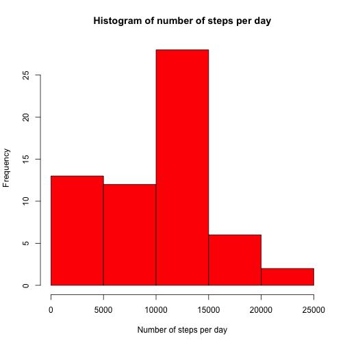
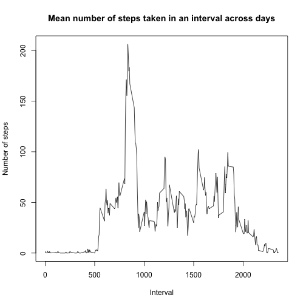
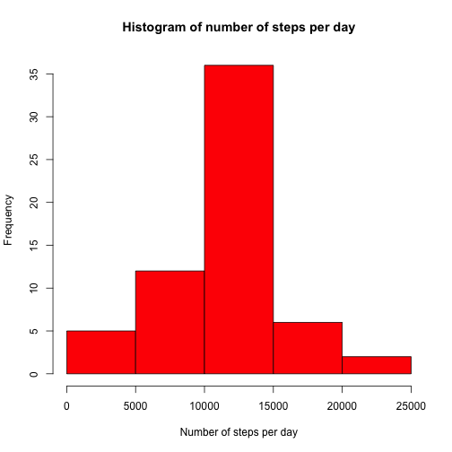

## Loading and preprocessing the data

```r
unzip("activity.zip")
data <- read.csv("activity.csv")
data$date <- as.Date(strptime(data$date, '%Y-%m-%d'))
```

## What is mean total number of steps taken per day?

```r
day_steps <- data.frame(tapply(data$steps,list(data$date),sum,na.rm = TRUE))
colnames(day_steps) <- 'steps'
hist(day_steps$steps,xlab="Number of steps per day",col="red",main="Histogram of number of steps per day")
```

 

```r
day_steps_mean <- mean(day_steps$steps, na.rm = TRUE)
day_steps_median <- median(day_steps$steps, na.rm = TRUE)
```
The mean number of steps in a day is 9354.23.  
The median number of steps in a day is 1.0395 &times; 10<sup>4</sup>.

## What is the average daily activity pattern?

```r
interval_steps <- data.frame(tapply(data$steps,list(data$interval),mean,na.rm = TRUE))
colnames(interval_steps) <- 'steps'
plot(x = row.names(interval_steps), y = interval_steps$steps, type = 'l', xlab = 'Interval', ylab = 'Number of steps', main = 'Mean number of steps taken in an interval across days')
```

 

```r
max_steps_interval <- row.names(interval_steps)[which.max(interval_steps$steps)]
```
The interval in which, on an average, the maximum number os steps is taken, is 835.
## Imputing missing values

```r
num_NAs <- sum(is.na(data$steps))
data_new <- data
data_new$steps[is.na(data_new$steps)] <- interval_steps$steps[as.factor(data_new$interval[is.na(data_new$steps)])]
day_steps_new <- data.frame(tapply(data_new$steps,list(data_new$date),sum,na.rm = TRUE))
colnames(day_steps_new) <- 'steps'
hist(day_steps_new$steps,xlab="Number of steps per day",col="red",main="Histogram of number of steps per day")
```

 

```r
day_steps_mean_new <- mean(day_steps_new$steps, na.rm = TRUE)
day_steps_median_new <- median(day_steps_new$steps, na.rm = TRUE)
```

The total number of missing values is 2304  
Strategy for filling in the missing data: Replace each missing value by the mean for that interval across dates.  
The mean number of steps in a day is 1.076619 &times; 10<sup>4</sup>.  
The median number of steps in a day is 1.076619 &times; 10<sup>4</sup>.

## Are there differences in activity patterns between weekdays and weekends?

```r
data_new$wde <- weekdays(data_new$date,FALSE)
wkends <- c('Saturday','Sunday')
data_new$wde <- ifelse(data_new$wde %in% wkends,'weekend','weekday')
data_new$wde <- as.factor(data_new$wde)
interval_wde_steps_new <- aggregate(data_new$steps,by = list(wde = data_new$wde, interval = data_new$interval),FUN = mean, na.rm = TRUE)
colnames(interval_wde_steps_new)[3] = 'steps'
library(ggplot2)
qplot(interval, steps, data = interval_wde_steps_new, facets = wde ~ ., geom = "line")
```

 
